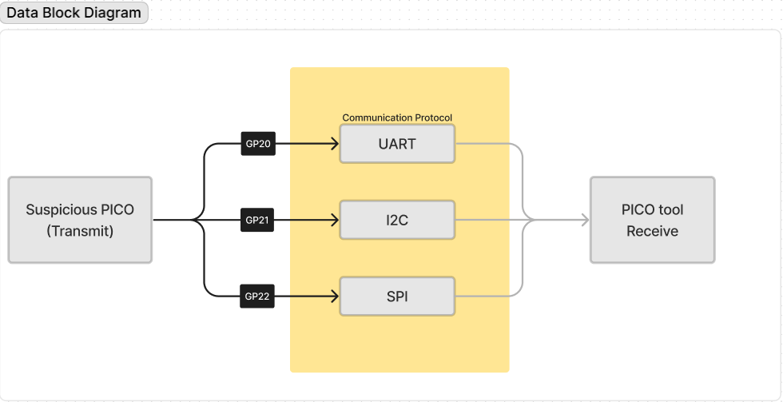
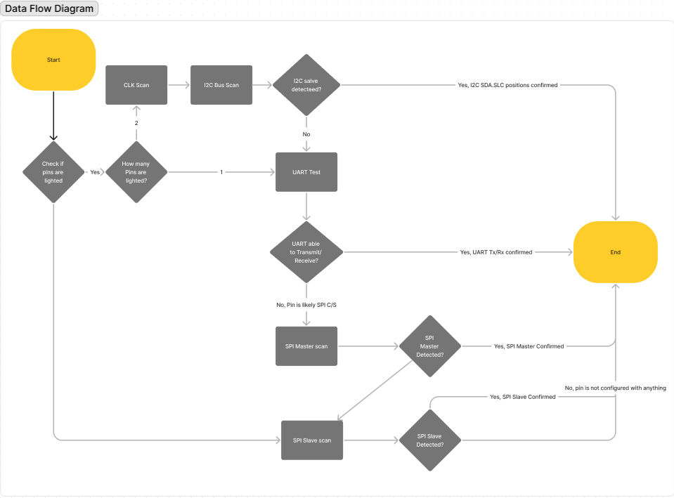

# ProjectPinID
INF2004 Embedded Systems ProjectPinID

Done by: 
2202574 Ng Jing Kai
2201930 Eugene Tan Jun Yu
2201940 Brandon Loo Jia Le
2201594 Danzel Lim
2201428 Eugene Tan Le Xuan

## Description of Project Pin Finder Pico 

Project Context
Pins on the Raspberry Pi Pico has been scratched and only VCC, GND, VBUS are visible. The project team set out to aid people in identifying the pico pins by doing a series of test to determine the communication protocol to allow the pico to be of use instead of replacing the pico.

## Project Objectives
Our project proposal outlines a set of clear objectives:

Development of a pico tool for pin identification using pico_w and pico maker board: 
The tool when used in conjunction with the pico board allows toggling of 3 different communication protocols to detect a transmit or receive signal from the scratched pico.

Example use cases
1. Scratched Pins UART testing
When the Pico Tool is running receive signal code, it should be tested with the scratched pico to test for any transmit of UART signals.

2. Scratched Pins I2C  testing
Testing of finding CLK signals allows identification of I2C protocol as pins are initialized to be high in pairs. 

After identification of CLK, doing a bus scan would determine if I2C is running as slave addresses are stored in memory.

3. Scratched Pins SPI testing
After process of elimination from single pin that is high, if it fails the UART test, it is deemed as SPI C/S as it is initialized as high as well. 

Afterwhich, with the determination of CLK signals, testing of 4 pins with the CLK signal and C/S would allow testing of SPI protocol. 

Pin Identification:
Testing for Pin identifications. The pins should correspond to certain testing to affirm the tester that the pin could be used for a multitude of purpose such as (I2C, UART, SPI)

## Overview of the project program
Block Diagram: 

The diagram shows the set up of the 2 picos that are transmitting through their communication protocol to yield a positive communication result on the Pico Tool.

The GPs indicate the 3 different buttons used to handle the toggling of the communications to be used for testing. 

Data Flow Diagram:

The data flow diagram shows the stages in testing that is broken down in tasks below:	

## Required libraries and software:
stdio.h: This standard input/output library in C provides functions for input and output operations.

pico/stdlib.h: This header file is essential for Pico Standard Library, providing basic functionality for Raspberry Pi Pico projects.

hardware/uart.h: This library is required for UART (Universal Asynchronous Receiver-Transmitter) communication, enabling serial communication.

hardware/i2c.h: This library is crucial to facilitate communication between devices that utilise the I2C communication protocol.

hardware/gpio.h: This library is essential for GPIO (General Purpose Input/Output) operations, allowing interaction with pins and digital signals.

hardware/spi.h: this library is necessary to establish communication between devices using that utilise the SPI communication protocol.

stdbool.h: This standard C library provides support for Boolean data types and operations, enhancing code readability and logical expressions.

Tasks:
Write code to test the pins for response according to their individual pin functions: 
UART:
Initialize UART Interface:
Specify the UART pins to be tested RX (Receive).
Pin selection:
Test all single pins that are initialized as high.
Data Reception:
Attempt to receive data through the UART RX pin.
Data Validation:
Successful UART communication means accurate transmission and reception.
Output Indication:
Display a message on the serial monitor to indicate whether the UART pin test was successful.
Documentation:
Record the results of the UART pin test. If successful, document that the pin supports UART communication.

I2C: 
Testing CLK signal to determine if pin is a CLK
Run I2C Bus Scan script: Execute the I2C bus script pin identification that tries to read data from the I2C slave.
Testing for: 
SDA (Serial Data) - The line on which master and slave devices send and receive data.
SCL (Serial Clock) - The line that carries the clock signal, generated by the master device to synchronise data transmission.
Data Validation: After communication, pico tool would display the memory address of the slave would be deemed successful I2C function.

Observe and Record: Check if the tool successfully receive data from the I2C slave. If it does, the pin supports I2C communication.

SPI:
To test for SPI, SPI uses four lines: 
MOSI (Master Out Slave In), 
MISO (Master In Slave Out), 
SCLK (Serial Clock), 
CS/SS (Chip Select/Slave Select).

Testing for SPI:
After testing UART single pins, and identifying CLK signals, by process of elimination, we can assume that the remaining pins are for SPI and connect SCLK and CS lines first. 

Connect the SPI: Wire up the device's MOSI, and MISO lines to the scratched pico to test for SPI communication.

Initialize SPI in Code: In the SPI communication script, initialise the SPI interface specifying the pins you're testing for MOSI, MISO, SCLK, and CS.

Attempt Communication: The script sends and receives from the MOSI and MISO lines respectively. If we do not get any response from the pico after confirming the CS and CLK lines, the pico may be wired incorrectly and we swap the MISO and MOSI lines.

Validate the Output: Confirm that the data read back is what is expected. If it is, then the pins support SPI.

Output Results: The Pico Tool should be monitoring on serial monitor and receive data from the scratched pico.

## User Guide:
Before conducting testing, ensure that both the debugger tool board and the scratched, victim board are both connected to the testing computer.
To activate the testing for each protocol, press the buttons on the Pico that correspond to the desired protocol to be tested:

GP20 - UART
GP21 - I2C (Only press after wires are connected, to print output to the serial monitor)
GP22 - SPI 

UART
To test for UART, connect GP1 on the debugger board to the desired pins for testing. 
Observe output in the serial monitor.
The code will conduct testing on different baud rates, and if readable, alphabetic letters are sent and displayed on the serial monitor, UART is present on the pin being tested.

SPI
To test for SPI, connect GP3 on the debugger board to the desired pins for testing.
The different outputs observed will lead to several conclusions about the pin being tested.
No response: Master In Slave Out (MISO)
Stable Signal: Clock
Identified from UART testing: Chip Select (During UART testing, when jibberish, unreadable characters are sent, it shows that it is initialised as high, therefore it is a Chip Select pin)
Unstable Clock Signal: Master Out Slave In (MOSI)

I2C
To test for I2C, connect GP4 and GP5 to pairs of consecutive pins on the scratched board.
To produce output, once connected, press GP21 to print output to the serial monitor.

## Task Allocation

BRANDON LOO JIA LE
UART ,I2C , SPI, CLK pin identification

EUGENE TAN JUN YU
I2C , SPI , CLK pin identification

NG JING KAI
UART , I2C, CLK pin identification

DANZEL LIM
I2C, CLK pin identification

EUGENE TAN LE XUAN
SPI, CLK pin identification

